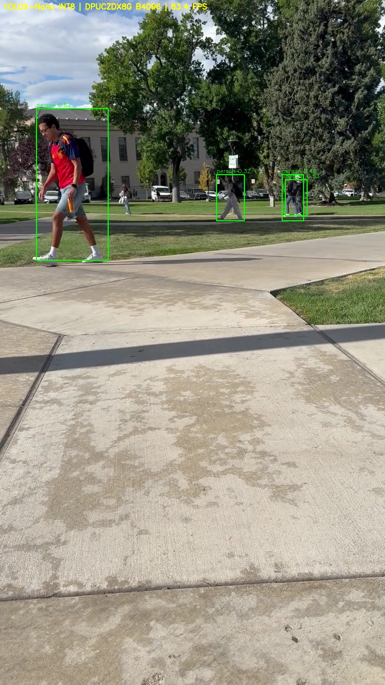
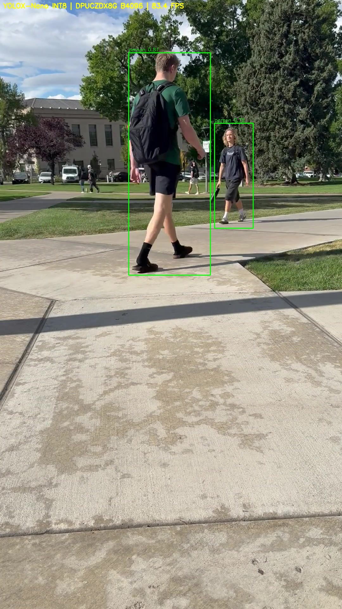
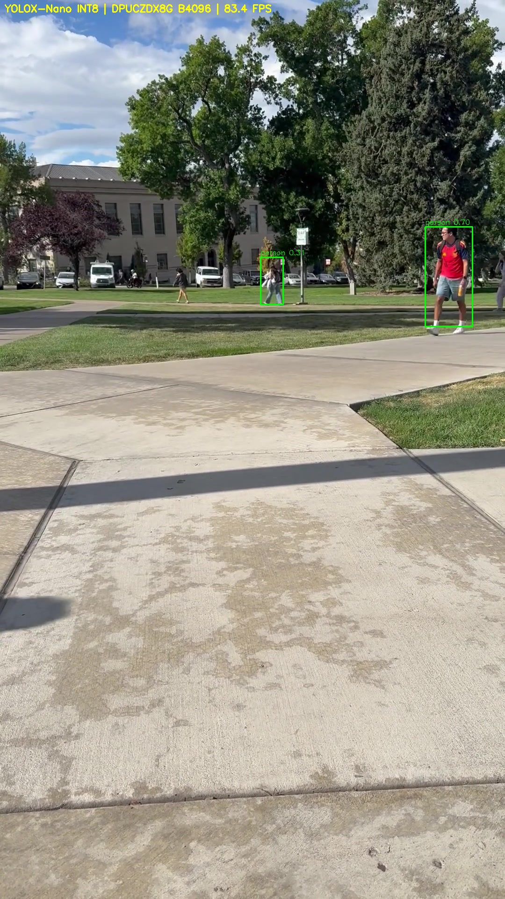
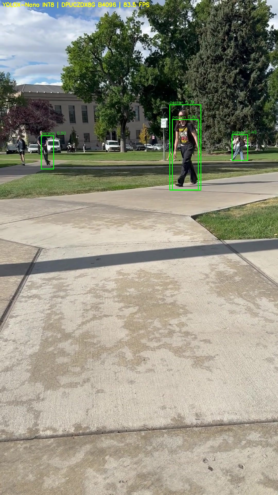

# Quantized YOLOX deployed onto an FPGA

Quantized INT8 YOLOX-Nano object detection on a Kria KV260 board via the DPUCZDX8G B4096 DPU

| | |
|---|---|
| Model | YOLOX-Nano, `pt_yolox-nano_coco_416_416_1G_3.0` (Vitis AI 3.0 model zoo) |
| Target | Kria KV260, DPUCZDX8G B4096 @ 300 MHz, fingerprint `0x101000056010407` |
| Float mAP @[.50:.95] | 0.220 (matches AMD published) |
| INT8 PTQ mAP @[.50:.95] | 0.136 (matches AMD published) |
| Graph partitioning | 808/808 ops on the DPU, 1 DPU subgraph, no CPU fallback |
| DPU throughput | 242.228 FPS (`xdputil benchmark`, 1 thread) |
| Full-pipeline throughput | 83.48 FPS (preprocess + DPU + NMS, per frame) |
| Quantization reproducibility | Detections byte-identical to AMD's own PTQ artifact |

https://github.com/user-attachments/assets/360b8162-96f9-477c-bc45-8cd0b5c83b4c

## Why I built this

I did this as my first personal project because I was interested in what deploying a model onto an edge device looked like and wanted to familiarize myself with the full model deployment pipeline. Even though I was interested in learning more about deployment as a whole, I found I particularly enjoyed the problem-solving involved, as even though I used an example model from the provided zoo, some problems still arose from my CPU only enviroment and the provided runner not working. In the future I want to apply my knowledge of the full pipeline to my own custom ML model, trained from a dataset I make myself, to try and better understand quantization-aware training and its limitations. 

## Contents

- [Toolchain (pinned)](#toolchain-pinned)
- [Reproduce](#reproduce)
- [Float (FP32) baseline](#float-fp32-baseline)
- [Post-Training Quantization](#post-training-quantization)
- [Board deployment](#board-deployment)
- [Three-way comparison](#three-way-comparison)
- [Live inference demo](#live-inference-demo)
- [Custom inference runner](#custom-inference-runner)
- [Repository layout](#repository-layout)
- [License](#license)

# Technical details and insights below

## Toolchain (pinned)
- Vitis AI 3.0, image `xilinx/vitis-ai-pytorch-cpu:ubuntu2004-3.0.0.106`
- Python 3.7.12, PyTorch 1.12.1 (CPU), torchvision 0.13.1+cpu
- pytorch_nndct 3.0.0, conda env `vitis-ai-pytorch`
- Host: Windows 11 + WSL2 (Ubuntu 22.04), CPU-only

**Why 3.0 and not newer:** 3.0 is the last release shipped with a
verified prebuilt KV260 SD image with a matching quantizer, compiler and runtime.
The pin matters across release boundaries also: the `DPUCZDX8G_ISA1_B4096`
fingerprint is `0x101000016010407` in 2.5 and `0x101000056010407` in 3.0, and VART
refuses to load an xmodel whose fingerprint doesn't match the hardware's. Quantizer,
compiler, runtime and board image therefore all have to come from the same release.

## Reproduce

**Host.** Vitis AI 3.0 repo at tag `v3.0`, PyTorch CPU container, COCO val2017 and
train2017 under `<repo>/data/coco`. `scripts/setup_container.sh` restores the
container state (explained later).

```
cp scripts/setup_container.sh ~/vitis/Vitis-AI/
cd ~/vitis/Vitis-AI
./docker_run.sh xilinx/vitis-ai-pytorch-cpu:ubuntu2004-3.0.0.106
conda activate vitis-ai-pytorch
source /workspace/setup_container.sh
```

**Quantize**:

```
cd /workspace/model_zoo/pt_yolox-nano_coco_416_416_1G_3.0
bash code/run_quant.sh
```

Produces `quantize_result/YOLOX_0_int.xmodel`.

**Compile for the KV260 DPU**:

```
vai_c_xir -x quantize_result/YOLOX_0_int.xmodel \
          -a /opt/vitis_ai/compiler/arch/DPUCZDX8G/KV260/arch.json \
          -o /workspace/compiled/yolox_nano_ptq \
          -n yolox_nano_ptq
```

**Board setup**:
Flash `xilinx-kv260-dpu-v2022.2-v3.0.0.img.gz` to microSD. The KV260
boots QSPI→SD by default, so no boot-mode switches. Serial console at 115200/8/N/1
over USB micro-B. Verify the DPU with `xdputil query` — expect arch
`DPUCZDX8G_ISA1_B4096`, fingerprint `0x101000056010407`.

**Deploy**:
The library resolves models by directory name, so the directory, the
xmodel and the prototxt must all share one name:

```
/usr/share/vitis_ai_library/models/yolox_nano_ptq/
    yolox_nano_ptq.xmodel
    yolox_nano_ptq.prototxt
```

The prototxt is just copied from AMD's `yolox_nano_pt` package and renamed; it is
architecture-level configuration and can be reused. Both files which were deployed are
committed at `compiled/yolox_nano_ptq/`, so this step can be done without
re-running the quantizer or compiler.

**Run**: (build command explained in Custom inference runner section):

```
./run_yolox yolox_nano_ptq input.jpg output.jpg
```

## Float (FP32) baseline

Model: `pt_yolox-nano_coco_416_416_1G_3.0` taken from Vitis AI 3.0 model zoo
Eval set: full COCO val2017, 5000 images
Host: CPU-only container, batch 32, `--conf 0.001`

| Metric | Result | AMD published |
| - | - | - |
| AP @[.50:.95] | 0.220 | 0.220 |
| AP @.50 | 0.365 | |
| AP @.75 | 0.226 | |
| AP small | 0.062 | |
| AP medium | 0.225 | |
| AP large | 0.357 | |
| AR @[.50:.95] maxDets=100 | 0.384 | |

Average forward time 8.42 ms (CPU, batch 32). Full log: `results/float_eval_val2017.log`

My baseline matches the published figure exactly, confirming dataset paths,
preprocessing, and evaluator setup.

### CPU patch to model zoo evaluation tooling

The zoo's `code/tools/eval.py` has no CPU code path: it asserts `num_gpu <=
torch.cuda.device_count()`, then calls `torch.cuda.set_device()` unconditionally.
`code/run_eval.sh` hardcodes `GPU_NUM=1`. On the CPU-only container this fails at
`AttributeError: module 'torch._C' has no attribute '_cuda_setDevice'`.

Patched four CUDA calls behind `torch.cuda.is_available()` guards across two files. 
I left TensorRT branch's `.cuda()` call as it is not reached
without `--trt`. See `patches/cpu_eval.patch`.

### Expected quantization target

AMD documents this model's results: float 0.22, PTQ 0.136,
QAT 0.21. Quantization-aware training (0.21) over full COCO is out of scope for me, so 
post-training quantization (0.136) is the target for the INT8 stage.


## Post-Training Quantization

I ran AMD's full shipped PTQ flow (`code/run_quant.sh`) on CPU: calibration,
quantized evaluation, xmodel export.

My INT8 mAP landed at **0.136**, matching AMD's documented PTQ figure and the
target committed to this README on 2026-08-30 — before I quantized.

Metrics below are from the **test pass** (`results/quant_run.log`, line 1658).

| Metric | Float | INT8 (PTQ) | Retained |
|---|---|---|---|
| AP @[.50:.95] | 0.220 | **0.136** | 62% |
| AP @.50 | 0.365 | 0.264 | 72% |
| AP @.75 | 0.226 | 0.132 | 58% |
| AP small | 0.062 | 0.041 | 66% |
| AP medium | 0.225 | 0.155 | 69% |
| AP large | 0.357 | 0.226 | 63% |
| AR @[.50:.95] maxDets=100 | 0.384 | 0.298 | 78% |

### Calibration scales are identical to AMD's reference

I diffed my generated `quant_info.json` against the one AMD ships in the
package's `quantized/` directory:

    diff <(python3 -m json.tool quantize_result/quant_info.json) \
         <(python3 -m json.tool quantized/quant_info.json)

Across 2,025 lines the only difference is a `version` metadata key. Every
quantization scale matches exactly, and hence the mAP matching is a result of the same
procedure producing the same numbers.

Note PTQ never passes '--fast_finetune', but both files record `"bias_corrected": true`. Bias correction is part of nndct's
default PTQ configuration, not an opt-in step. 

### INT8 performance impacts

AP@.50 retains 72% of float performance while AP@.75 retains 58%. This tells us the model
still finds objects but it places their boxes less precisely. The box regression
head, not detection or classification, is the main casualty of INT8.

I expected that small objects would be the dominant failure
mode after PTQ — AP-small was the weakest float metric at 0.062. It degraded, but with a 66%
retention it actually held up better than the 62% headline. 

### Calibration set

`run_quant.sh` does not take a calibration data argument. AMD's reference PTQ flow calibrates on whatever dataloader the
evaluation config builds, which is val2017, and as such the published 0.136 was produced by calibrating on 
that. My originial plan was a seeded 500-image calibration from train2017, but after realizing this,
I decided in order to validate the pipeline thouroughly to use val2017 as well. 

Calibration and evaluation therefore share data, so 0.136 is not a clean
generalized figure - it is a reproduction figure, and reproducing AMD's number
was the point of this stage.

### Environment reconstruction/Scripting

The Vitis AI container's writable layer is discarded on exit. Files under
`/workspace` survive from the bind mount but `pip` installs and any editable install of
`yolox` do not. I had to rebuild my CPU patch a day later, which is why I made the script
`scripts/setup_container.sh` — container entry is now easier and reproducible.

| Issue | Resolution |
|---|---|
| `yolox` not importable | `PYTHONPATH=<pkg>/code`, not `pip install -e code/` |
| Missing `pycocotools`, `thop` | Installed with `protobuf==3.18.1` pinned explicitly |
| `tensorboard` pulled in by `yolox.core.__init__` | Commented out the training-only `Trainer` import |
| `quant.py` hardcodes CUDA | Two lines behind `torch.cuda.is_available()` |
| `coco_evaluator_q.py` hardcodes CUDA tensor types | Same as `patches/cpu_eval.patch` |
| `GPU_NUM=1` trips the device-count assertion | Set to `0` in `run_quant.sh` |

**`PYTHONPATH` over `pip install -e code/`:** the package's `requires.txt`
inherits upstream YOLOX's pins — `onnx==1.8.1`, `onnxruntime==1.8.0`,
`onnx-simplifier==0.3.5` — which would fight the container's own ONNX and
protobuf stack. Those are Megvii's export dependencies, unused by the Vitis AI
flow. A path variable achieves the same import with no dependency.

**Patching out `tensorboard` rather than installing it:** TensorBoard pulls
protobuf, and XIR uses protobuf for xmodel serialization. Overwriting protobuf
3.18.1 to satisfy a training-only dependency might have become an issue later. 
`quant.py` never references `Trainer`, so the import
is simply removed.

### Artifacts

- `results/quant_run.log` — full run output, version banner, both COCO tables
- `results/quant_info.json` — generated quantization scales
- `scripts/setup_container.sh` — reproducible container setup
- `compiled/yolox_nano_ptq/yolox_nano_ptq.xmodel` — the deployed compiled model
  
## Board deployment

Compiled `quantize_result/YOLOX_0_int.xmodel` with `vai_c_xir` targeting
`DPUCZDX8G_ISA1_B4096`. The board reports arch `DPUCZDX8G_ISA1_B4096`, fingerprint
`0x101000056010407`, DPU IP v4.1.0 @ 300 MHz, VART 3.0.0, on image
`xilinx-kv260-dpu-v2022.2-v3.0.0`.

The compiler mapped all 808 ops to a single DPU subgraph with no CPU fallback
inside the backbone. This is why I used the model zoo's ReLU deploy
variant with the pre-cut detection head rather than stock YOLOX-Nano: SiLU
activations and the head's permute/view ops would have fragmented the graph across DPU and CPU subgraphs.

I did note that recompiling the same quantized model with the same command in the same container produced
a byte-different xmodel (84643990... vs the deployed 41d578ce...). Both are functionally equivalent
— the three-way comparison below was run against the deployed artifact. I did not identify the cause of the
byte difference. 

Worth noting: the float evaluation is reproducible. `results/float_eval_val2017.log`
and a re-run I did a day later differ by only timestamps. The non-determinism is in the
compiler specifically, not the pipeline around it.

Board bring-up log: `results/xdputil_query.json`.
Compile logs: `results/compile_ptq_rerun.log`, `results/compile_amd_ptq.log`.

### DPU throughput

| Model | FPS (1 thread) | Frames / 60 s |
| - | - | - |
| This PTQ model | 242.228 | 14535 |
| AMD precompiled control | 242.302 | 14539 |

Measured with `xdputil benchmark`, which times DPU execution only and excludes
host-side pre- and post-processing - application throughput will be lower.
Only a 0.03% gap against AMD's precompiled model on identical hardware confirms my
compiled artifact executes with no throughput penalty compared to AMD's.
However, functional equivalence is established separately in the three-way comparison below.

Raw logs: `results/bench_ptq.log`, `results/bench_amd_control.log`.

Deployed artifact md5: `41d578ce4e0fd48944011c007a5e9783`

## Three-way comparison

All three models run through the same custom runner (`src/run_yolox.cpp`,
`vitis::ai::YOLOvX` API), same input image (COCO val2017 `000000000139`), same
prototxt thresholds (conf 0.3, NMS 0.65), and of course same board.

| Model | Source | Detections |
| - | - | - |
| `yolox_nano_ptq` | My PTQ → `vai_c_xir` | 5 |
| `yolox_nano_amd_ptq` | AMD's `quantized/` PTQ output → `vai_c_xir` | 5 |
| `yolox_nano_pt` | AMD precompiled, shipped in the model zoo tarball | 12 |

**My PTQ output and AMD's PTQ output produce identical detections** — same count,
same labels, same confidence scores, same box coordinates.
Combined with the earlier findings that `quant_info.json` quantization scales are
identical and `bias_corr.pth` is byte-identical, this is confirmation 
that the PTQ pipeline in this repo reproduces AMD's.

The annotated outputs are in fact byte-identical, not merely equivalent:
`det_mine_ptq.jpg` and `det_amd_ptq.jpg` both hash to
`6db26bde80822a3bb19071aba4925a1c`.

The precompiled model shipped as `yolox_nano_pt-zcu102_zcu104_kv260-r3.0.0.tar.gz`
is therefore not the PTQ model, despite being the deployable artifact in a package
that documents a PTQ flow. It recovers detections both PTQ models miss (potted plants,
a second and third TV, and two clocks). AMD's package README documents float 0.220,
PTQ 0.136 and QAT 0.210 for this model; in my opinion, this gap is consistent with the
precompiled artifact being the QAT variant, though this is not verified. Verifying this
would mean running COCO evaluation on the board against the precompiled model, which would 
take a while, so I did not do it.

Detection output and annotated images: `results/detections/`

## Live inference demo

60 seconds of handheld footage, 910 frames at 15 fps, run through on
the KV260. Boxes and the running frame rate are drawn by the runner itself. 1212 detections across 910 frames.






The last frame is a miss — one objects but two boxes. At 0.136 mAP,
this is expected. 

Full run output: `results/demo_run.txt`.

### Throughput

| Measurement | FPS | Covers |
| - | - | - |
| `xdputil benchmark` | 242.23 | DPU execution only, pre-loaded tensors, tight loop |
| Inference-only | 83.48 | Library preprocess + DPU + postprocess/NMS, per frame |
| End-to-end | 6.25 | The above plus JPEG decode and annotated-frame encode |

The gap between the first two is interesting. `xdputil benchmark` isolates
the DPU, and the 83.48 figure is the same DPU doing the same work, but additionally the library's
letterbox/resize/normalize preprocessing, its decode and NMS post-processing
running on the ARM cores around it. This means roughly two thirds of per-frame
time is host-side work, not DPU work. Once the DPU is fast enough,
the ARM cores become the bottleneck, meaning further DPU optimization wouldn't do much.

The end-to-end FPS is due to the workaround described below rather than a
property of the deployed system, since per-frame JPEG decode and re-encode is not what
a real pipeline would do.

### Why frames, not video

The Vitis AI 3.0 KV260 board image ships OpenCV 4.5.2 with GStreamer, but not the
plugin set needed to decode H.264. `VideoCapture` on an MP4 fails: the hardware
decoder at `/dev/allegroDecodeIP` cannot be allocated, and the software fallback
reports a missing plugin.

Rather than rebuild the image's media stack, frames are decoded on the host with
`ffmpeg`, transferred, run through `src/run_yolox_frames.cpp` as a numbered sequence,
and reassembled into video on the host afterwards. Detection, timing and annotation
all happen on the board; only codec work is moved off it.

## Custom inference runner

Vitis AI Library ships two generic sample applications on the board image,
`general1/general_example_0` and `xmodel_image/test_jpeg_xmodel_image`. Neither
worked here. `general_example_0` segfaults immediately on any model, including
AMD's own precompiled YOLOX — `-h` prints usage correctly, so the crash is after
argument parsing and before the library logs anything, and `GLOG_v=1` produces no
output before the fault. `ldd` reports no missing libraries and the crash is identical
with and without `DISPLAY` set, so its not a packaging problem nor does a headless OpenCV explain it.
I couldn't determine the root cause. 

Rather than debug, I decided to build a custom runner:
`src/run_yolox.cpp`.

### API

The relevant class is `vitis::ai::YOLOvX`.
As AMD's header uses YOLOvX, a case-sensitive search for
"yolox" misses it and returns only the protobuf definitions.
The factory takes a model name, not an xmodel path:

```cpp
auto yolo = vitis::ai::YOLOvX::create("yolox_nano_ptq", true);
auto results = yolo->run(img);
```

Passing a name triggers the library's directory resolution: it looks up `/usr/share/vitis_ai_library/models/<name>/`,
loads `<name>.xmodel`, and reads `<name>.prototxt` for post-processing
configuration. Without the prototxt there is no decode step — the DPU would return
raw output tensors and nothing would convert them to labelled boxes.

`run()` returns a `YOLOvXResult` whose `.bboxes` carry `.label`, `.score`, and a
4-element `.box` of coordinates.

### What my runner does

Takes a model name, an input image and an output path. Reads the image with
OpenCV, calls `run()`, prints each detection as label index, confidence and box
corners, draws rectangles, and writes an annotated JPEG. Output is via `imwrite`,
so **no display or X11 is required** — this a headless board.

Passing the model name as an argument rather than hardcoding made the
three-way comparison possible: the same binary runs all three models, so any
difference in output is attributable to the model rather than to the harness.

`src/run_yolox_frames.cpp` is the same runner over a numbered frame sequence. It
adds per-frame timing, COCO class names, and a frame-rate overlay, and reports
inference-only and end-to-end throughput separately at the end.

### Build

Compiled on the board

```
g++ -std=c++17 -O2 -I/usr/include/opencv4 run_yolox.cpp -o run_yolox \
    -lvitis_ai_library-yolovx -lvitis_ai_library-dpu_task \
    -lvart-runner -lxir -lglog \
    -lopencv_core -lopencv_imgproc -lopencv_imgcodecs
```

The frame-sequence runner additionally needs `-lopencv_videoio`:

```
g++ -std=c++17 -O2 -I/usr/include/opencv4 run_yolox_frames.cpp -o run_yolox_frames \
    -lvitis_ai_library-yolovx -lvitis_ai_library-dpu_task \
    -lvart-runner -lxir -lglog \
    -lopencv_core -lopencv_imgproc -lopencv_imgcodecs -lopencv_videoio
```


## License

MIT. See [LICENSE](LICENSE).

`compiled/yolox_nano_ptq/yolox_nano_ptq.prototxt` is derived from AMD's Vitis AI
model zoo package and is Apache 2.0.
